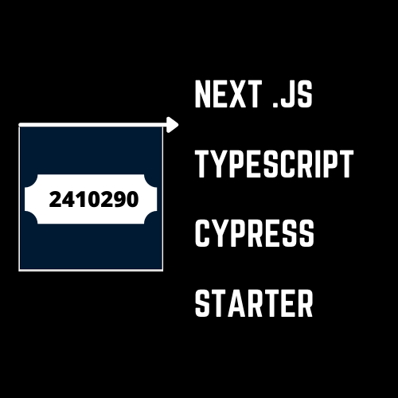

<p align="center">
  
</p>

A TypeScript starter for Next.js & Cypress that includes all you need to build amazing projects 🔥

- ⚛️ **Next** — React Framework ( TypeScript )
- 🧪 **Cypress** — JavaScript test automation solution
- 📏 **ESLint** — Pluggable JavaScript linter
- 💖 **Prettier** — Opinionated Code Formatter

## 🚀 Getting started

The best way to start with this template is using `create-next-app`.

```
npx create-next-app ts-next -e https://github.com/YousfiHamza/Next-Typescript-Cypress-Starter
```

If you prefer you can clone this repository and run the following commands inside the project folder:

1. `npm install`
2. `npm run dev`

To view the project open `http://localhost:3000`.

To run your test, use the command :

    npm run cypress

if you're having some issues related to cypress instalation, then run this command at the root of your project folder (otherwise you can ignore this step):

    .\node_modules\.bin\cypress.cmd install

---

Made with ♥ by <strong>Hamza</strong>
